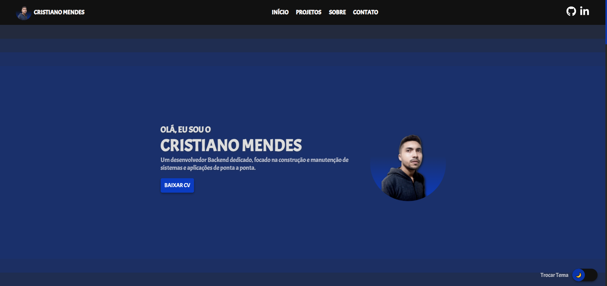
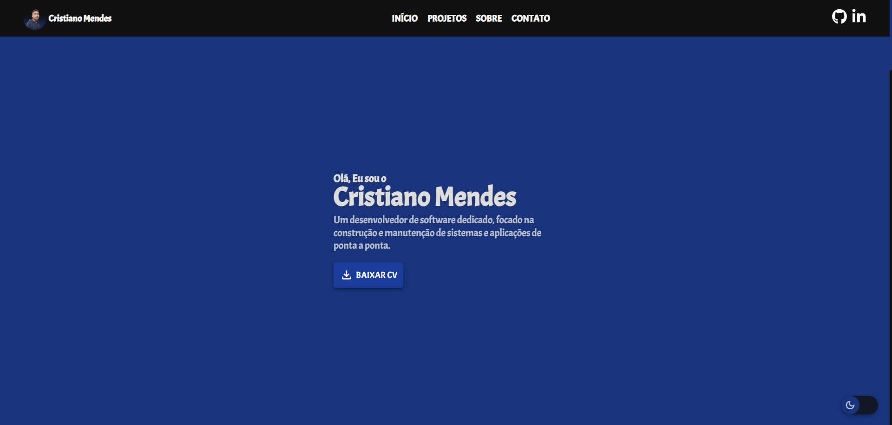
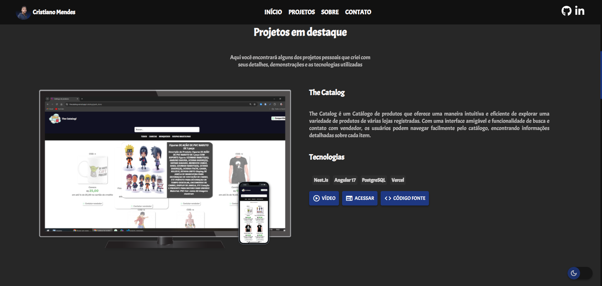

<h1 align="center" style="font-weight: bold;">Portifolio💻</h1>

 <a href="#technologies">Tecnologias</a> • 
 <a href="#screen">Capturas de Tela</a>

    <b></b>

<h2 id="technologies">💻 Tecnologias</h2>

Angular 17

<h2 id="screen" align="center">Capturas de Tela</h2>

V1 - Home

V2 - Home

V2 - Projetos

[Clique Aqui](https://cristianomendes.vercel.app/)
